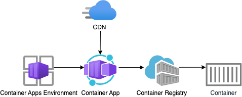

This repository includes a very simple Python Flask web site, made for demonstration purposes only.

## Opening the project

This project has [Dev Container support](https://code.visualstudio.com/docs/devcontainers/containers), so it will be be setup automatically if you open it in Github Codespaces or in local VS Code with the [Dev Containers extension](https://marketplace.visualstudio.com/items?itemName=ms-vscode-remote.remote-containers).

If you're not using one of those options for opening the project, then you'll need to:

1. Create a [Python virtual environment](https://docs.python.org/3/tutorial/venv.html#creating-virtual-environments) and activate it.

2. Install the requirements:

    ```shell
    python3 -m pip install -r requirements-dev.txt
    ```

3. Install the pre-commit hooks:

    ```shell
    pre-commit install
    ```

## Local development

1. Run the local server: (or use VS Code "Run" button and select "Run server")

    ```shell
    python3 -m flask --debug --app src/app:app run --port 5000
    ```

2. Click 'http://127.0.0.1:5000' in the terminal, which should open the website in a new tab
3. Confirm the photos load on the index page and click "Order Print" to see the order page.


### Local development with Docker

You can also run this app locally with Docker, thanks to the `Dockerfile`.
You need to either have Docker Desktop installed or have this open in Github Codespaces for these commands to work.

1. Build the image:

    ```shell
    docker build --tag flask-app src/
    ```

2. Run the image:

    ```shell
    docker run --publish 5000:5000 flask-app
    ```

## Deployment

This repo is set up for deployment on [Azure Container Apps](https://learn.microsoft.com/azure/container-apps/overview) using the configuration files in the `infra` folder.



Steps for deployment:

1. Sign up for a [free Azure account](https://azure.microsoft.com/free/) and create an Azure Subscription.
2. Install the [Azure Developer CLI](https://learn.microsoft.com/azure/developer/azure-developer-cli/install-azd). (If you open this repository in Codespaces or with the VS Code Dev Containers extension, that part will be done for you.)
3. Login to Azure:

    ```shell
    azd auth login
    ```

4. Provision and deploy all the resources:

    ```shell
    azd up
    ```
    It will prompt you to provide an `azd` environment name (like "flaskgallery"), select a subscription from your Azure account, and select a location (like "eastus"). Then it will provision the resources in your account and deploy the latest code. If you get an error with deployment, changing the location can help, as there may be availability constraints for some of the resources.

5. When `azd` has finished deploying, you'll see an endpoint URI in the command output. Visit that URI, and you should see the front page of the app! 🎉

6. When you've made any changes to the app code, you can just run:

    ```shell
    azd deploy
    ```

## CI/CD pipeline

This project includes a Github workflow for deploying the resources to Azure
on every push to main. That workflow requires several Azure-related authentication secrets
to be stored as Github action secrets. To set that up, run:

```shell
azd pipeline config
```

### Costs

Pricing varies per region and usage, so it isn't possible to predict exact costs for your usage.
The majority of the Azure resources used in this infrastructure are on usage-based pricing tiers.
However, Azure Container Registry has a fixed cost per registry per day.

You can try the [Azure pricing calculator](https://azure.com/e/200ae4891b274a0f87f12f2e936a45ba) for the resources:

- Azure CDN - Standard tier. Pricing is based off usage and each month allows for a certain amount of GB. [Pricing](https://azure.microsoft.com/pricing/details/cdn/)
- Azure Container App: Consumption tier with 0.5 CPU, 1GiB memory/storage. Pricing is based on resource allocation, and each month allows for a certain amount of free usage. [Pricing](https://azure.microsoft.com/pricing/details/container-apps/)
- Azure Container Registry: Basic tier. Pricing per registry per day. [Pricing](https://azure.microsoft.com/pricing/details/container-registry/)
- Log analytics: Pay-as-you-go tier. Costs based on data ingested. [Pricing](https://azure.microsoft.com/pricing/details/monitor/)

⚠️ To avoid unnecessary costs, remember to take down your app if it's no longer in use,
either by deleting the resource group in the Portal or running `azd down`.


## Getting help

If you're working with this project and running into issues, please post in **Discussions**.
